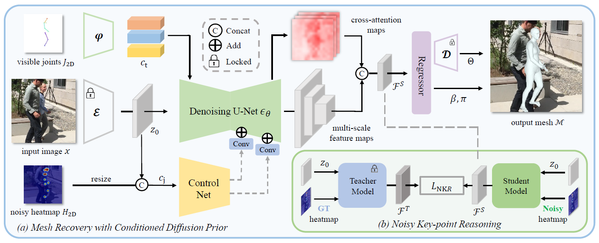

# DPMesh: Exploiting Diffusion Prior for Occluded Human Mesh Recovery
*[Yixuan Zhu\*](https://eternalevan.github.io/), [Ao Li\*](https://rammusleo.github.io/), [Yansong Tang†](https://andytang15.github.io/), [Wenliang Zhao](https://wl-zhao.github.io/), [Jie Zhou](https://scholar.google.com/citations?user=6a79aPwAAAAJ&hl=en&authuser=1), [Jiwen Lu](http://ivg.au.tsinghua.edu.cn/Jiwen_Lu/)*
----
The repository contains the official implementation for the paper "DPMesh: Exploiting Diffusion Prior for Occluded Human Mesh Recovery" (CVPR 2024).

DPMesh is an innovative framework for occluded human <ins>**Mesh**</ins> recovery that capitalizes on the profound <ins>**D**</ins>iffusion <ins>**P**</ins>rior about object structure and spatial relationships embedded in a pre-trained text-to-image diffusion model.
## 📋 To-Do List

* [x] Release model and inference code.
* [ ] Release code for training dataloader .

## 💡 Pipeline



## ⭐️ Performance


## 🚪Quick Start
### ⚙️ 1. Installation
``` bash
conda env create -f environment.yaml
conda activate dpmesh
```
### 💾 2. Data Preparation

**For evaluation only, you can just prepare 3DPW dataset.**


### 🗂️ 3. Download Checkpoints

Please download our pretrained checkpoints from [this link](https://cloud.tsinghua.edu.cn/d/1d6cd3ee30204bb59fce/) and put them under `./checkpoints`. The file directory should be:

```
|-- checkpoints
|--|-- 3dpw_best_ckpt.pth.tar
|--|-- 3dpw-crowd_best_ckpt.pth.tar
|--|-- 3dpw-oc_best_ckpt.pth.tar
|--|-- 3dpw-pc_best_ckpt.pth.tar
```

### 📊 4. Test & Evaluation

You can test DPMesh use following commands:

```bash
CUDA_VISIBLE_DEVICES=0 \
torchrun \
--master_port 29591 \
--nproc_per_node 1 \
eval.py \
--cfg ./configs/main_train.yml \
--exp_id="main_train" \
--distributed \
```

The evaluation process can be done with one Nvidia GeForce RTX 4090 GPU (24GB VRAM). 

## 🫰 Acknowledgments

We would like to express our sincere thanks to the author of [JOTR](https://github.com/xljh0520/JOTR) for the clear code base and quick response to our issues. 

We also thank [ControlNet](https://github.com/lllyasviel/ControlNet), [VPD](https://github.com/wl-zhao/VPD) and [LoRA](https://github.com/cloneofsimo/lora), for our code is partially borrowing from them.

## 🔖 Citation

## 🔑 License

This code is distributed under an [MIT LICENSE](./LICENSE).
